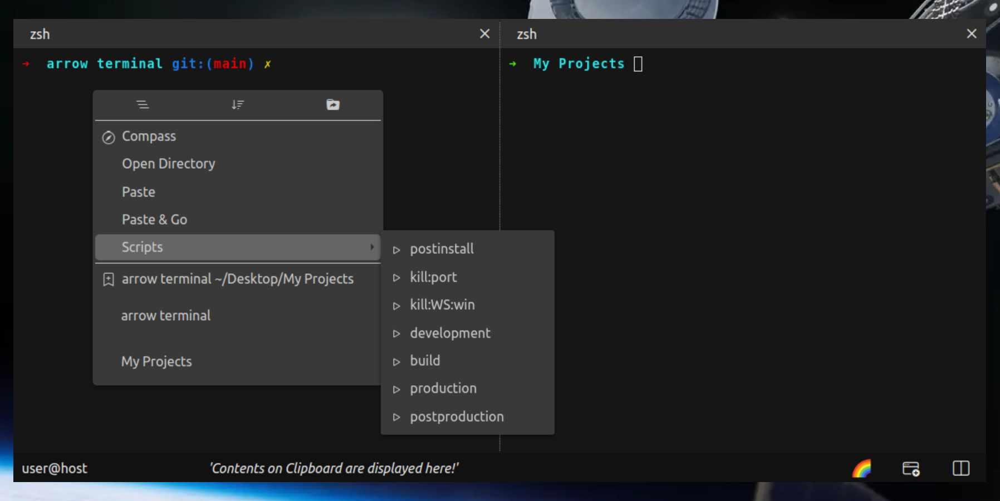

  

  

# Arrow Terminal

  

  

## Overview

Run Custom Commands for url's (eg. copy repo url from Github.com or any other webpage and execute custom commands defined under "terminal.url.actions" in Arrow Consoles' settings.json straight from Context Menu )
Note: only https webpages are supported

Bookmark your favourite directories for later use

Execute/Manage your projects in arrow console and leverage your multi monitor setup

Learning a new programming language or a just trying out it’s concept - Run single page programming files from VS Code with custom key bindings
(with [Extension for VS Code](https://marketplace.visualstudio.com/items?itemName=thevoyagingstar.arrow))

## Features

| Feature | Description | 
| :---: | :---: | 
| [Open in Arrow Terminal](OpenInArrow.md) | from Finder (Mac OS) or File Explorer (Linux/Windows). |
| Node Scripts | Run node scripts with yarn or npm. |
| Compass  |  Navigate to nearby or distant disrectories with ease of GUI. | 
| Adaptive Terminal Menu | Contents are modified based on current Context, hence you only see whats relevant and important. | 
|  Bookmarks | Add your favourite directories to bookmarks for Quick Access. | 
| Color Palletes | Customize every corner of arrow with your preferred color scheme or use default ones' out of box. | 

## Installation ##

    git clone git@github.com:UmangRajpara13/arrow.git
    cd ./arrow
    yarn

## Build Executable ##

    yarn run production

Platform specific Installable build will be available in dist folder after successfull execution of last command.
